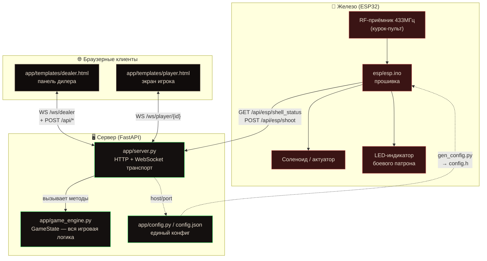
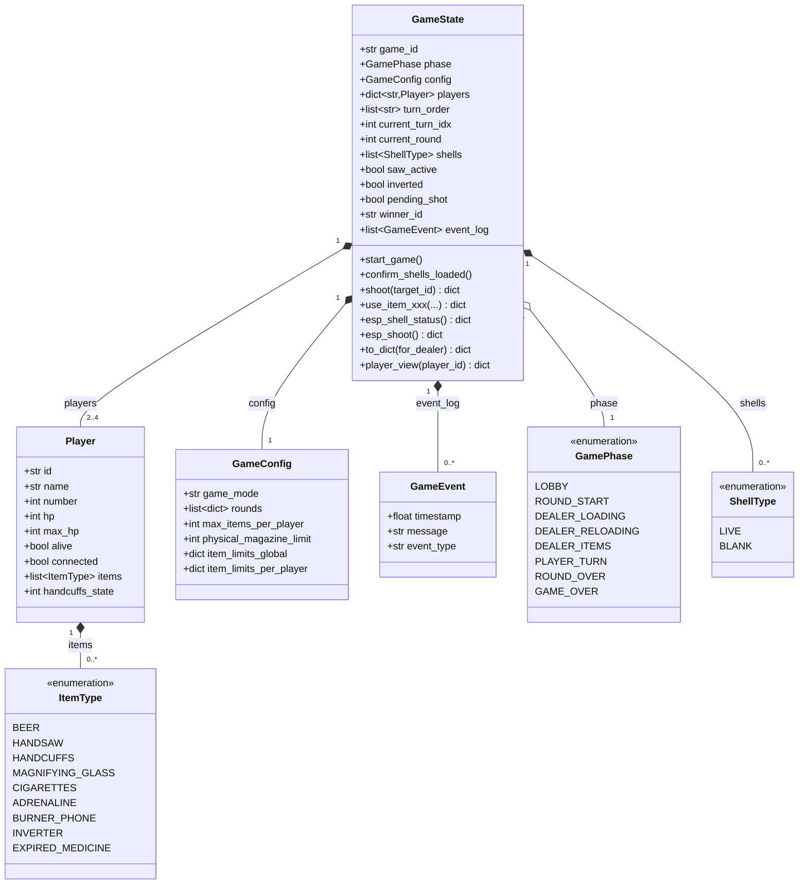
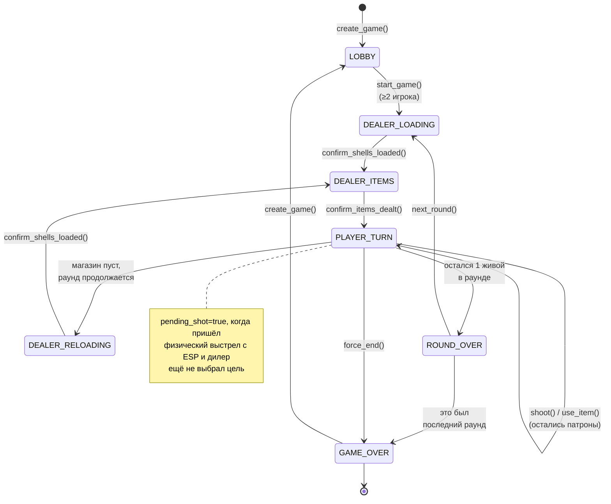
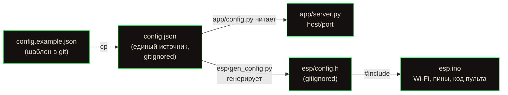

# Архитектура проекта — Buckshot Roulette IRL

Физическая реализация игры «Buckshot Roulette»: веб-панель дилера и телефоны
игроков управляют партией, а физический дробовик с соленоидом (ESP32 + RF-курок)
синхронизируется с игровой логикой.

---

## 1. Разделение ответственности (компоненты)

Каждый слой отвечает строго за своё. Игровая логика полностью изолирована в
`app/game_engine.py` и ничего не знает про HTTP/WebSocket/железо.



| Слой | Файл | Ответственность | Чего НЕ делает |
|------|------|-----------------|----------------|
| **Железо** | `esp/esp.ino` | Ловит RF-сигнал курка, бьёт соленоидом на боевом патроне, опрашивает сервер | Не хранит игровое состояние, не считает урон |
| **Транспорт** | `app/server.py` | HTTP-эндпоинты, WebSocket-рассылка, undo-стек, сериализация | Не содержит игровых правил — делегирует движку |
| **Логика** | `app/game_engine.py` | State machine, патроны, предметы, HP, ходы, победа | Не знает про сеть, HTTP, железо |
| **Конфиг** | `app/config.py`, `config.json` | Единый источник настроек (Wi-Fi, адрес, пины) | — |
| **UI дилера** | `app/templates/dealer.html` | Управление партией, меню «в кого попали?» | Не считает логику — только шлёт команды |
| **UI игрока** | `app/templates/player.html` | Показ HP/предметов игроку | Read-only, без секретов (порядок патронов скрыт) |

---

## 2. UML — модель данных движка (class diagram)

Всё состояние партии держится в единственном объекте `GameState` (in-memory,
без БД). Ключевые перечисления — `GamePhase`, `ShellType`, `ItemType`.



---

## 3. State machine — фазы партии

Игра — конечный автомат. Переходы инициируются действиями дилера (кнопки в
панели) или автоматически при исчерпании патронов / гибели игроков.



---

## 4. Алгоритм физического выстрела (ESP32 ↔ сервер ↔ дилер)

Ключевой поток проекта. Разделение: **соленоид бьёт мгновенно по кэшу** (без
задержки сети), а **игровой эффект (урон) подтверждает дилер**, чтобы патрон
списался из очереди ровно один раз.

```mermaid
sequenceDiagram
    autonumber
    participant P as 🔫 Игрок (курок)
    participant E as ESP32 (esp.ino)
    participant S as app/server.py
    participant G as game_engine (GameState)
    participant D as Панель дилера

    Note over E,S: Фоновый опрос раз в 5 сек
    loop каждые POLL_INTERVAL_MS
        E->>S: GET /api/esp/shell_status
        S->>G: esp_shell_status()
        G-->>S: {ready, live}
        S-->>E: {ready, live}
        Note over E: кэш обновлён;<br/>LED мигает если live
    end

    P->>E: нажатие курка (RF 433МГц)
    Note over E: код совпал с KNOWN_TRIGGER_CODE
    alt следующий патрон боевой (cachedLive)
        E->>E: импульс на соленоид (SOLENOID_PULSE_MS)
    else холостой
        E->>E: тишина
    end
    E->>E: pendingShoot = true

    Note over E: в loop() — неблокирующий POST
    E->>S: POST /api/esp/shoot
    S->>G: esp_shoot()
    Note over G: НЕ трогает очередь!<br/>ставит pending_shot=true
    G-->>S: {ok, fired, live}
    S->>D: broadcast_state() (WS)
    Note over D: показывает меню<br/>«⚡ В КОГО ПОПАЛИ?»

    D->>S: POST /api/shoot {target_id}
    S->>G: shoot(target_id)
    Note over G: shells.pop(0) — патрон ушёл 1 раз<br/>урон + смена хода<br/>pending_shot=false
    G-->>S: {shell, damage, target_hp_after}
    S->>D: broadcast_state() (WS) — меню исчезает
```

---

## 5. Развёртывание и конфиг



**Запуск сервера:**
```bash
pip install -r requirements.txt
python -m app.server            # слушает config.json → server.host:server.port (0.0.0.0:8000)
```

**Прошивка ESP32:**
```bash
python esp/gen_config.py    # config.json → esp/config.h
arduino-cli compile --fqbn esp32:esp32:esp32 esp/
arduino-cli upload -p /dev/cu.usbserial-XX --fqbn esp32:esp32:esp32 esp/
```

---

## Ключевые архитектурные решения

1. **Игровая логика изолирована** — `app/game_engine.py` не импортирует ничего сетевого; тестируется отдельно от сервера.
2. **In-memory состояние** — один глобальный `GameState`, без БД (теряется при рестарте сервера).
3. **ESP не блокируется на сети** — соленоид срабатывает по кэшу, HTTP-запросы уходят из `loop()`, а не из обработчика курка (иначе watchdog ронял плату).
4. **Патрон списывается один раз** — ESP-выстрел только выставляет `pending_shot`; фактический `shells.pop(0)` и урон — при выборе цели дилером.
5. **Секреты вне git** — `config.json` и `esp/config.h` (Wi-Fi пароль) игнорируются; в репозитории только `config.example.json`.
